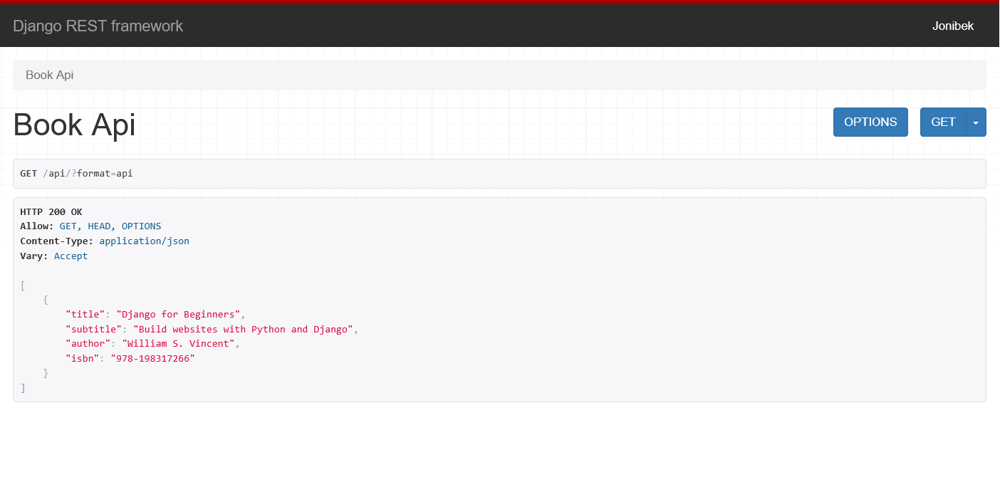

# DRF Books API

This project was created for learning purposes to understand the basics of Django REST Framework.
It demonstrates how to build a simple API that returns book data in JSON format using generic views and serializers.
