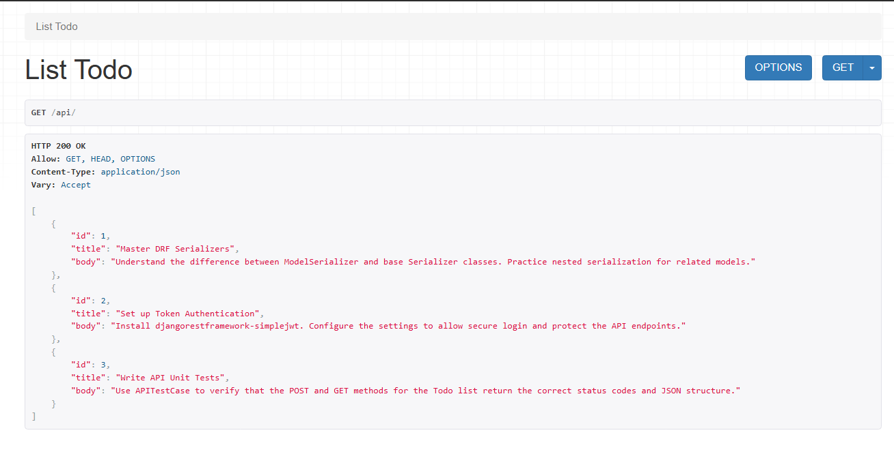
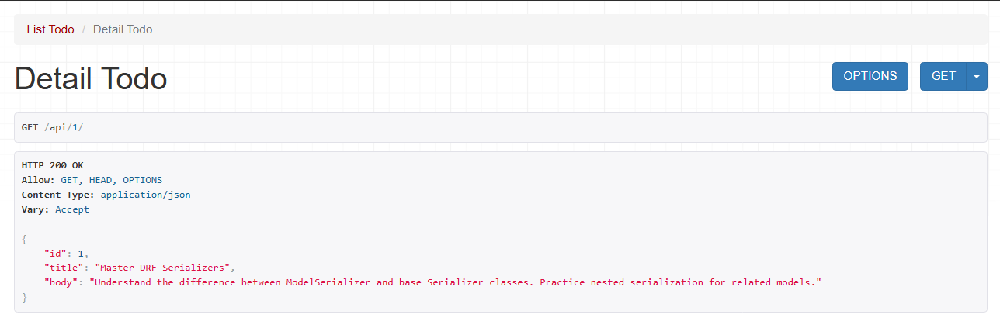

# Todo Backend (DRF Learning Project)

A simple, functional REST API built to master the fundamentals of Django REST Framework (DRF).

### 1. List View
- Returns a collection of all todos. Route: `/api/`

### 2. Detail View
- Returns a single todo by its ID. Route: `/api/<int:id>/`

